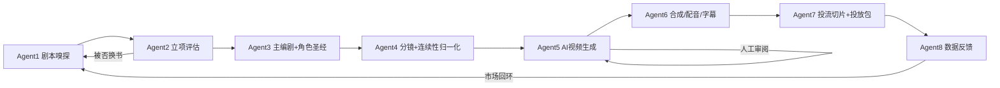

# DramaMatrix · AI 短剧自动化生产流水线

> 从小说选题到可投放短视频的 **多 Agent 编排系统**：文本 → 分镜 → AI 视频生成 → 剪辑/配音/字幕 → 投流切片 → 数据留档，一条命令跑通主链路。


---

## 它能做什么

DramaMatrix 是一个面向**个人工作室 / 小团队**的 AI 短剧（竖屏漫剧/剧情短剧）生产系统。它把"选题 → 立项 → 编剧 → 分镜 → 视频生成 → 剪辑 → 投流 → 数据回流"拆成 8 个 Agent，并用 LangGraph 编排成一条可暂停、可恢复、可审计的流水线。



### 核心能力

| 能力 | 说明 |
|------|------|
| 🎬 **多 Agent 编排** | 选品→立项→编剧→分镜→生成→剪辑→切片→回流的完整链路（LangGraph 状态机） |
| 🧠 **角色一致性** | 角色圣经（多源抽取 + LLM）、canonical ID 合并、分镜连续性字段、尾帧条件链式生成 |
| 🎥 **视频生成** | Agnes Video 集成：逐镜提交、首帧/参考图条件输入、同场景共享 seed、断点恢复 |
| ✂️ **后期** | FFmpeg 拼接、TTS 配音（edge-tts/OpenAI 可配）、ASS 大字报字幕、BGM 混音 + 响度标准化 |
| 📦 **投放准备** | hook/climax 情绪段切片、标题/简介/标签/封面元数据、一键导出投放包（zip） |
| 🛡️ **生产保护** | 预算上限熔断、队列满退避重试、幂等创建（防重复扣费）、任务恢复、故障处置清单 |
| 📊 **可复现实验** | 资产 SHA-256、真实媒体参数、QC 结果落库、运行配置快照、状态历史、人工评分表 |
| 👤 **人工把关** | 逐镜审阅清单（approve/redraw/delete），质量与成本可控 |

---

## 快速开始

### 1. 环境准备

```bash
# Python 3.10+
pip install -r requirements.txt

# 视频拼接/抽帧/字幕烧录需要 ffmpeg + ffprobe 在 PATH 中
# macOS: brew install ffmpeg
```

### 2. 配置密钥

```bash
cp code/.env.example code/.env
# 编辑 code/.env：
#   - AGNES_API_KEY  （视频生成，必填）
#   - OPENAI_API_KEY 或 TEXT_MODEL_API_KEY（文本模型，Agent 2-4）
#   - DRAMAMATRIX_TTS_PROVIDER=edge （可选，启用免费配音）
```

### 3. 运行

```bash
cd code
python main.py --project-id Drama_20260307_001
```

- **断点续跑**：同一 `--project-id` 重跑即从上次未完成阶段继续
- **分集生产**：`DRAMAMATRIX_EPISODE=ep_01 python main.py` 只处理指定集
- **人工审阅**：渲染完成后运行 `python -m src.review_approver <project> <ep>` 逐镜标记，再重跑推进
- **故障处置**：流程阻塞时自动生成 `failure_report.json`，按清单处置后重跑

---

## 流水线细节

| Agent | 职责 | 输入 → 输出 |
|-------|------|-------------|
| **Agent 1** 剧本嗅探 | 选品（本地库优先，支持市场标签定向） | 小说 → `source_material` |
| **Agent 2** 爆点评估 | 多角色辩论立项；被否自动换书重试 | 素材 → `EvaluationReport` |
| **Agent 3** 主编剧 | 时间线拆集 + 角色圣经生成（LLM + 确定性回退） | 大纲 → 30 集拆解 + `CharacterSheet` |
| **Agent 4** 分镜 | 15–25 镜/集，连续性字段 + end_state 归一化；数量门禁 | 大纲 → `ShotStoryboard[]` |
| **Agent 5** AI 导演 | 逐镜提交 Agnes、条件生成、逐镜 QC、镜头级重绘、人工审阅 | 分镜 → 镜头视频资产 |
| **Agent 6** 剪辑 | FFmpeg 拼接、TTS 配音/混音、字幕烧录、成片证据 | 镜头 → 成片 master/voiced/subtitled |
| **Agent 7** 投流 | hook/climax 切片 + 元数据 + 投放包导出 | 成片 → `GrowthAsset[]` + `publish.zip` |
| **Agent 8** 数据 | 市场反馈回流，驱动下一轮选品（市场回环） | 投放数据 → `MarketFeedback` |

---

## 配置速查

所有配置在 `code/.env`（详见 `.env.example`），常用项：

| 变量 | 默认 | 说明 |
|------|------|------|
| `DRAMAMATRIX_PROJECT_ID` | `Drama_20260307_001` | 项目 ID，决定断点续跑目标 |
| `DRAMAMATRIX_MAX_CYCLES` | `1` | 市场回环周期上限（>1 开启闭环） |
| `DRAMAMATRIX_CONDITIONAL_GENERATION` | `0` | 条件链式生成（首帧/尾帧传递） |
| `DRAMAMATRIX_VIDEO_PROVIDER` | `agnes` | 视频供应商（agnes / dummy） |
| `DRAMAMATRIX_REVIEW_MODE` | `1` | 渲染后暂停人工审阅 |
| `DRAMAMATRIX_PUBLISH_EXPORT` | `1` | 完成后导出投放包 |
| `DRAMAMATRIX_TTS_PROVIDER` | 空 | 配音后端（edge / openai） |
| `DRAMAMATRIX_MAX_AGNES_CREATES` | `0` | 单项目创建预算护栏（0=不限） |
| `DRAMAMATRIX_MAX_TOTAL_SHOTS` | `120` | 全剧总镜头预算 |
| `AGNES_POST_RETRY_ATTEMPTS` | `4` | 队列满安全重试次数（30→300s 退避） |

---

## 可复现与审计

- **资产证据链**：每个镜头/成片记录 SHA-256、真实时长/分辨率/帧率、音轨信息、seed、参考图哈希、模型版本、响应摘要
- **QC 落库**：每镜亮度差/阈值/首尾帧哈希写入 `shot_qc_results`，支持跨镜跨集分析
- **运行快照**：git SHA、非敏感配置、依赖版本、ffmpeg 版本随状态持久化（`run_context`）
- **状态历史**：`state_history` 追加式保存，支持版本回溯与审计
- **人工评分**：`manual_scores` 表 + CSV 导入/导出，0–5 评分协议 + 轮次去重

---

## 项目结构

```
code/
├── main.py                 # 入口（恢复/分集/故障报告）
├── src/
│   ├── agents/             # Agent 1-8
│   ├── graph.py            # LangGraph 编排与路由
│   ├── state.py            # 全局状态模型（Pydantic）
│   ├── agnes_video.py      # Agnes 客户端 + 媒体工具（哈希/抽帧/探测）
│   ├── tts.py              # 配音（edge/openai）+ BGM/响度
│   ├── subtitles.py        # ASS 字幕烧录
│   ├── review.py           # 人工审阅清单
│   ├── publish.py          # 投放包导出
│   ├── model_providers.py  # 视频供应商抽象（Agnes/Dummy）
│   ├── failure_report.py   # 故障处置清单
│   ├── run_context.py      # 运行环境快照
│   ├── db.py               # SQLite（状态/历史/QC/评分/用量）
│   └── ...
└── tests/                  # 171 项测试（媒体/Agnes/ffmpeg 全 mock）
```

---

## 测试

```bash
cd code
python -m pytest tests/ -q
# 171 passed —— 无 ffmpeg 环境也可全绿（媒体调用走 mock）
```

---

## 路线图 / 已知边界

**当前阶段**：一人受控试制（1 集、3–20 镜、小批量真实联调）。

- [ ] 真实媒体集成测试（真实 MP4 / 真实 QC 失败 / 完整恢复链路）
- [ ] 角色身份相似度自动质检（CLIP/InsightFace 可插拔）
- [ ] 跨场景有限并发接入主循环
- [ ] 运营看板界面（项目面板/成本统计/版本对比）
- [ ] 版权与素材权属管理

---

## 说明

- 本项目为**个人工作室实验性工程**，视频生成依赖外部服务（Agnes），其价格/队列/接口变化可能影响生产。
- 爬虫与市场数据目前为模拟实现，接入真实来源前请注意合规。
- 所有密钥仅存于 `.env`，不会写入数据库或日志。

---

<p align="center"><sub>Made for personal studios & small teams · 从选题到投放，一条命令。</sub></p>
