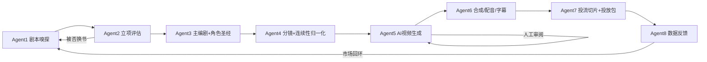

# DramaMatrix · AI 短剧自动化生产流水线

> 从小说选题到可投放短视频的 **多 Agent 编排系统**：文本 → 分镜 → AI 视频生成 → 剪辑/配音/字幕 → 投流切片 → 数据留档，一条命令跑通主链路。


---

## 它能做什么

DramaMatrix 是一个面向**个人工作室 / 小团队**的 AI 短剧（竖屏漫剧/剧情短剧）生产系统。它把"选题 → 立项 → 编剧 → 分镜 → 视频生成 → 剪辑 → 投流 → 数据回流"拆成 8 个 Agent，并用 LangGraph 编排成一条可暂停、可恢复、可审计的流水线。



### 核心能力

| 能力 | 说明 |
|------|------|
| 🎬 **多 Agent 编排** | 选品→立项→编剧→分镜→生成→剪辑→切片→回流的完整链路（LangGraph 状态机） |
| 🧠 **角色一致性** | 角色圣经（多源抽取 + LLM）、canonical ID 合并、分镜连续性字段、尾帧条件链式生成、**角色参考图自动生成与消费（U2）** |
| 🎥 **视频生成** | **供应商可路由（U1）**：`DRAMAMATRIX_VIDEO_PROVIDER=agnes/dummy`，Agent5 只依赖中立接口；Agnes 逐镜提交、条件输入、同场景共享 seed、断点恢复 |
| 🖼️ **图像生成** | **参考图链路（U2）**：`reference_image_prompt` → 生成 → SHA-256 落库 → 场景首镜条件输入（OpenAI 兼容 /images/generations 或 dummy） |
| 🔍 **逐镜 QC** | 亮度差 + **dHash 结构相似度（U3）**（默认告警、可开硬门禁）+ **Vision-LLM 身份质检（W4）**，失败样本同样落库 |
| ✂️ **后期** | FFmpeg 拼接、TTS 配音（edge-tts/OpenAI 可配）、ASS 大字报字幕、BGM 混音 + 响度标准化 |
| 📦 **投放准备** | hook/climax 情绪段切片、标题/简介/标签/封面元数据、一键导出投放包（zip） |
| 🛡️ **生产保护** | 预算上限熔断、队列满退避重试、幂等创建（防重复扣费）、任务恢复、故障处置清单 |
| 📊 **可复现实验** | 资产 SHA-256、真实媒体参数、QC 结果落库、运行配置快照、状态历史、人工评分表 |
| 👤 **人工把关** | 逐镜审阅清单（approve/redraw/delete）+ **本地审阅 Web 界面（U4）**，质量与成本可控 |
| 📚 **先验知识库** | **检索式 RAG（U6）**：Agent2 按书名/摘录从 knowledge_entries 表检索 top-k 先验，运营可增补 |
| ✏️ **Prompt 外置** | 创作 prompt 存于 `code/prompts/*.md`（U5），改风格不动代码，文件缺失自动回退内置默认 |
| 🔧 **分镜修正工具（W1）** | `storyboard_editor` 导出/导入分镜 JSON、解除 storyboard_blocked，不再直接改数据库 |
| 📥 **真实数据源（W2）** | 本地小说库（txt 目录）+ 投放数据回流（CSV/JSON 导入），合规替换 mock 入口与出口 |
| ⚖️ **版权权属（W3）** | 权属声明落库（rights_records），投放包携带来源授权 + AI 内容披露 |
| 📊 **运营看板（W5）** | `dashboard_server` 只读聚合项目进度/供应商用量/QC 通过率/重绘榜，数据全部来自证据链 |

---

## 快速开始

### 1. 环境准备

```bash
# Python 3.10+
pip install -r requirements.txt

# 视频拼接/抽帧/字幕烧录需要 ffmpeg + ffprobe 在 PATH 中
# macOS: brew install ffmpeg
```

### 2. 配置密钥

```bash
cp code/.env.example code/.env
# 编辑 code/.env：
#   - AGNES_API_KEY  （视频生成，必填）
#   - OPENAI_API_KEY 或 TEXT_MODEL_API_KEY（文本模型，Agent 2-4）
#   - DRAMAMATRIX_TTS_PROVIDER=edge （可选，启用免费配音）
```

### 3. 运行

```bash
cd code
python main.py --project-id Drama_20260307_001
```

- **运行模式（R1）**：默认 `production`——无书源/模型失败/无投放数据一律阻塞并给出修复指引，模拟回退不再悄悄发生；演示用 `DRAMAMATRIX_RUN_MODE=demo`（或 `--run-mode demo`），mock 内容全部带标记
- **断点续跑**：同一 `--project-id` 重跑即从上次未完成阶段继续（含 `editing_failed`/`growth_failed` 等失败断点；同一项目并发启动会被运行锁拒绝，退出码 3）
- **分集生产**：`DRAMAMATRIX_EPISODE=ep_01 python main.py` 只处理指定集——其余集原样保留在项目快照中，不会被删除或降级
- **前台人工审阅**：`DRAMAMATRIX_REVIEW_MODE=interactive python main.py --project-id <project>`，到审阅点直接在当前终端操作并继续
- **后台人工审阅**：`DRAMAMATRIX_REVIEW_MODE=background nohup ...`，完成清单后以同一项目 ID 断点续跑
- **浏览器审阅台（U4）**：`cd code && python -m src.review_server <project> <ep>`，缩略图墙逐镜标记 approve/redraw/delete，保存写入同一份 `decisions.json`，`--resume` 续跑生效
- **运营看板（W5）**：`cd code && python -m src.dashboard_server`，只读查看项目进度/用量/QC 统计
- **分镜修正（W1）**：`cd code && python -m src.storyboard_editor <project> <ep> export` 导出 JSON 人工修正后 `import --file ...`，或 `reset` 直接解除 `storyboard_blocked`
- **本地小说库（W2）**：`DRAMAMATRIX_LOCAL_NOVEL_DIR=/path/to/novels`（txt 文件即书目，首行可写 `# tags: 男频,玄幻`）
- **投放数据回流（W2）**：`DRAMAMATRIX_ANALYTICS_IMPORT=/path/to/ads.csv`（列：ep_id,views,cpa,completion_rate,tags）
- **容器运行（W7）**：`docker build -t dramamatrix . && docker run --rm --env-file code/.env -v "$PWD/data:/app/data" dramamatrix --project-id demo`
- **故障处置**：流程阻塞时自动生成 `failure_report.json`，按清单处置后重跑
- **整集验收（R2）**：Agent6 合成后自动暂停（`awaiting_episode_review`），核片后 `python -m src.episode_review <project> <ep> approve|rework --note ...`；验收清单含对白时间表（哪句被变速/溢出/未合成）
- **成本报表（R3）**：配置价目表后 `python -m src.cost_report <project_id>` 查看单集费用、每分钟合格成片成本、重绘占比（金额为估算口径，可对账）

---

## 流水线细节

| Agent | 职责 | 输入 → 输出 |
|-------|------|-------------|
| **Agent 1** 剧本嗅探 | 选品（本地库优先，支持市场标签定向） | 小说 → `source_material` |
| **Agent 2** 爆点评估 | 多角色辩论立项；被否自动换书重试 | 素材 → `EvaluationReport` |
| **Agent 3** 主编剧 | 时间线拆集 + 角色圣经生成（LLM + 确定性回退） | 大纲 → 30 集拆解 + `CharacterSheet` |
| **Agent 4** 分镜 | 15–25 镜/集，连续性字段 + end_state 归一化；数量门禁 | 大纲 → `ShotStoryboard[]` |
| **Agent 5** AI 导演 | 逐镜提交 Agnes、条件生成、逐镜 QC、镜头级重绘、人工审阅 | 分镜 → 镜头视频资产 |
| **Agent 6** 剪辑 | FFmpeg 拼接、角色音色 TTS、对白时间表（禁截断/变速上限/溢出记录）、字幕对齐语音真实起止、整集验收暂停 | 镜头 → 成片 master/voiced/subtitled |
| **Agent 7** 投流 | hook/climax 切片 + 元数据 + 投放包导出与完整性验证（清单/哈希/缺失阻断） | 成片 → `GrowthAsset[]` + `publish.zip` |
| **Agent 8** 数据 | 市场反馈回流（真实导入幂等去重；production 无数据进入等待而非写模拟值），回流后集进入 `analytics_done` 终态 | 投放数据 → `MarketFeedback` |

---

## 运行模式与数据可信度（R1）

`DRAMAMATRIX_RUN_MODE` 决定无真实输入时的行为，默认 `production`：

| 场景 | production（默认） | demo |
|------|--------------------|------|
| 本地小说库未配置/为空 | 选品阻塞 `blocked_on_source` | mock 书目 |
| 评审/编剧模型调用失败 | `blocked_on_text_model` / `blocked_on_script`，保留失败可 `--resume` 重试 | 模拟过审 / 固定回退剧情（标记 `demo_fallback`） |
| 投放数据未配置/导入失败 | `waiting_for_market_data`，**零写入** | 写一条 `source='simulated'` 模拟行 |
| 模拟数据参与决策 | 否（推荐查询仅用 `source='imported'` 且按播放量加权） | 仅演示 |

**状态与数据完整性**：

- 按集限定运行是"选择工作范围"：保存快照时按键合并，其余集及其资产原样保留
- 同一项目同一时刻只允许一个生产进程（flock 运行锁，持有方信息写入锁文件）
- `analytics` 表带 `project_id / platform / source / dedup_key`：同一导入文件重复执行自动去重；旧版存量行迁移为 `legacy_unverified`，不参与选题推荐
- 自动换书回环默认关闭（`DRAMAMATRIX_AUTO_NEXT_CYCLE=0`）：回环会在同一项目与集键上开新书，开启前需先建立"项目—作品—周期"隔离

## 可靠成片与可控生产（R2/R3）

**对白链路（不截断、可核对）**：分镜携带说话人（`speaker`）→ 配音按 `DRAMAMATRIX_TTS_VOICE_MAP` 选角色音色 → 逐句实测时长排时间表：窗口内原速；超出按 `DRAMAMATRIX_TTS_MAX_SPEED`（默认 1.35）变速；到上限仍放不下则**保留完整语音、标记 overflow、后续句顺延**——绝不截断。字幕时间窗用语音真实起止（无配音时回退镜头窗口）。对白检测三态：仅语音编解码/音轨标记明确时才保留原音轨，"只有一条音轨"不再判为对白（纯 BGM 同样是单音轨）。

**交付门禁链**：镜头通过 → 合成完成 → **整集验收**（人工核片，`python -m src.episode_review <project> <ep> approve|rework`）→ 投流切片 → **交付包完整性验证**（包内每个切片哈希与清单一致、封面/ZIP 存在；验证不过不得标记 `growth_ready`）→ 数据回流。

**金额成本账本**：`DRAMAMATRIX_PRICE_VIDEO_CREATE` 等价目配置后启用——分镜确认时预估（剩余镜头×单价）并检查 `DRAMAMATRIX_EPISODE_BUDGET`/`DRAMAMATRIX_PROJECT_BUDGET`（超预算 `storyboard_blocked`）；每次付费创建前查剩余额度（不足则熔断，零入账）；费用按 预留→确认 生命周期记账（资产通过完整性校验才算确认，幂等可恢复），重绘自动计入重绘占比；`python -m src.cost_report <project_id>` 出报表。价目未配置时金额护栏休眠，按次数的护栏（`MAX_AGNES_CREATES`）不受影响。

---

## 配置速查

所有配置在 `code/.env`（详见 `.env.example`），常用项：

| 变量 | 默认 | 说明 |
|------|------|------|
| `DRAMAMATRIX_PROJECT_ID` | `Drama_20260307_001` | 项目 ID，决定断点续跑目标 |
| `DRAMAMATRIX_RUN_MODE` | `production` | production 阻塞一切模拟回退 / demo 显式演示（带标记） |
| `DRAMAMATRIX_AUTO_NEXT_CYCLE` | `0` | 自动换书回环开关（默认关闭，开启前先读上节说明） |
| `DRAMAMATRIX_MAX_CYCLES` | `1` | 市场回环周期上限（需 `AUTO_NEXT_CYCLE=1` 才生效） |
| `DRAMAMATRIX_CONDITIONAL_GENERATION` | `0` | 条件链式生成（首帧/尾帧传递） |
| `DRAMAMATRIX_VIDEO_PROVIDER` | `agnes` | 视频供应商（agnes / dummy） |
| `DRAMAMATRIX_REVIEW_MODE` | `background` | `interactive` 前台交互 / `background` 后台暂停 / `off` 跳过审阅 |
| `DRAMAMATRIX_PUBLISH_EXPORT` | `1` | 完成后导出投放包 |
| `DRAMAMATRIX_TTS_PROVIDER` | 空 | 配音后端（edge / openai） |
| `DRAMAMATRIX_EPISODE_REVIEW` | `1` | 整集验收门禁：合成后暂停等人工核片（approve/rework） |
| `DRAMAMATRIX_PRICE_VIDEO_CREATE` | 空 | 视频单价（估算）：配置后启用金额账本与预算门禁 |
| `DRAMAMATRIX_EPISODE_BUDGET` | `0` | 单集金额预算（0=不限；价目配置后生效） |
| `DRAMAMATRIX_MAX_AGNES_CREATES` | `0` | 单项目创建预算护栏（0=不限） |
| `DRAMAMATRIX_MAX_TOTAL_SHOTS` | `120` | 全剧总镜头预算 |
| `AGNES_POST_RETRY_ATTEMPTS` | `4` | 队列满安全重试次数（30→300s 退避） |

---

## 可复现与审计

- **资产证据链**：每个镜头/成片记录 SHA-256、真实时长/分辨率/帧率、音轨信息、seed、参考图哈希、模型版本、响应摘要
- **QC 落库**：每镜亮度差/阈值/首尾帧哈希写入 `shot_qc_results`，支持跨镜跨集分析
- **运行快照**：git SHA、非敏感配置、依赖版本、ffmpeg 版本随状态持久化（`run_context`）
- **状态历史**：`state_history` 追加式保存，支持版本回溯与审计
- **人工评分**：`manual_scores` 表 + CSV 导入/导出，0–5 评分协议 + 轮次去重

---

## 项目结构

```
code/
├── main.py                 # 入口（恢复/分集/故障报告）
├── prompts/                # 外置创作提示词（U5，可运营编辑）
├── src/
│   ├── agents/             # Agent 1-8
│   ├── graph.py            # LangGraph 编排与路由
│   ├── state.py            # 全局状态模型（Pydantic）
│   ├── agnes_video.py      # Agnes 客户端 + 媒体工具（哈希/抽帧/探测）
│   ├── provider_errors.py  # 供应商中立异常层级（U1）
│   ├── model_providers.py  # 视频供应商抽象 + RenderProfile（U1）
│   ├── image_providers.py  # 图像生成供应商（U2）
│   ├── character_refs.py   # 角色参考图生成/落库/回填（U2）
│   ├── continuity_qc.py    # 逐镜 QC：亮度差 + dHash 相似度（U3）
│   ├── knowledge_base.py   # 先验知识库检索（U6）
│   ├── prompt_files.py     # 外置 prompt 加载器（U5）
│   ├── review_server.py    # 审阅 Web 界面（U4）
│   ├── dashboard_server.py # 运营看板，只读（W5）
│   ├── storyboard_editor.py# 分镜导出/导入/解除 blocked（W1）
│   ├── local_sources.py    # 本地小说库 + 投放数据导入（W2）
│   ├── rights.py           # 版权权属声明（W3）
│   ├── identity_qc.py      # Vision-LLM 身份质检判官（W4）
│   ├── tts.py              # 配音（edge/openai）+ BGM/响度
│   ├── subtitles.py        # ASS 字幕烧录
│   ├── review.py           # 人工审阅清单
│   ├── publish.py          # 投放包导出
│   ├── failure_report.py   # 故障处置清单
│   ├── run_lock.py         # 项目运行锁（R1）
│   ├── runtime_options.py  # CLI 覆盖 + 运行模式（R1）
│   ├── episode_review.py   # 整集验收清单与决定 CLI（R2）
│   ├── cost_ledger.py      # 金额成本账本：预留/确认 + 预算护栏（R3）
│   ├── cost_report.py      # 成本报表 CLI（R3）
│   ├── run_context.py      # 运行环境快照
│   ├── db.py               # SQLite（状态/历史/QC/评分/用量/成本/知识库）
│   └── ...
└── tests/                  # 298 项测试（媒体/Agnes/ffmpeg 全 mock）
```

---

## 测试

```bash
cd code
python -m pytest tests/ -q
# 298 passed —— 无 ffmpeg 环境全绿（媒体 API 走 mock；依赖 mock 回退的用例显式 demo 模式）
# tests/test_real_media.py 在有 ffmpeg 时真实执行（CI 已安装 ffmpeg）
```

---

## 路线图 / 已知边界

**当前阶段**：一人受控试制（1 集、3–20 镜、小批量真实联调）。

- [x] 可信运行基座（R1：production/demo 双模式、按集运行不缩减快照、项目运行锁、analytics 幂等导入与来源隔离、失败断点可恢复重试）
- [x] 可靠成片（R2：说话人角色音色、对白时间表禁截断、字幕对齐语音、对白检测三态、整集验收门禁、交付包完整性验证）
- [x] 可控生产（R3：金额成本账本 预估/预留/确认、单集与项目预算门禁、分镜后成本预估、成本报表；价目未配置时按次数护栏）
- [x] 真实媒体集成测试（W6：test_real_media.py + CI 安装 ffmpeg 真实执行）
- [x] 逐镜结构相似度质检（dHash，`DRAMAMATRIX_QC_SIMILARITY_GATE` 可开硬门禁）
- [x] 角色身份相似度质检（W4：Vision-LLM 判官，`DRAMAMATRIX_IDENTITY_QC=1`；CLIP/InsightFace 仍可作为可插拔实现替换 checker）
- [x] 运营看板界面（W5：dashboard_server，只读聚合证据链）
- [x] 版权与素材权属管理（W3：rights 声明落库 + 投放包携带披露）
- [ ] 跨场景有限并发接入主循环（基础设施已就绪；Agnes 单任务在途即 queue_full，按既有评审结论暂缓，换供应商后可启用）
- [ ] 自动换书回环的产品化（R1 起默认关闭：需先建立"项目—作品—周期"隔离，避免同项目同集键复用导致资产混淆）
- [ ] 真实选品爬虫/投放平台 API 直连（W2 已提供合规的本地小说库与投放数据导入，直连待商务授权）

---

## 说明

- 本项目为**个人工作室实验性工程**，视频生成依赖外部服务（Agnes 等，经 `DRAMAMATRIX_VIDEO_PROVIDER` 可路由），其价格/队列/接口变化可能影响生产。
- 选品与市场数据支持真实接入（本地小说库 / 投放数据导入，W2）；production 模式下未配置会阻塞对应阶段，模拟路径仅 demo 模式可用且全部带标记，接入第三方平台直连前请注意合规。
- 投放包自带权属与 AI 生成披露（W3）；请在各平台按规则声明 AI 生成内容。
- 所有密钥仅存于 `.env`，不会写入数据库或日志。

---

<p align="center"><sub>Made for personal studios & small teams · 从选题到投放，一条命令。</sub></p>
